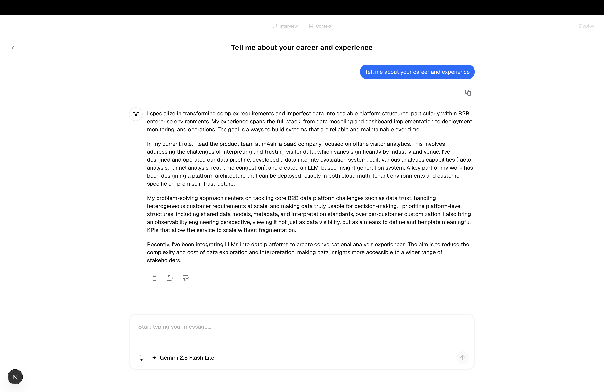
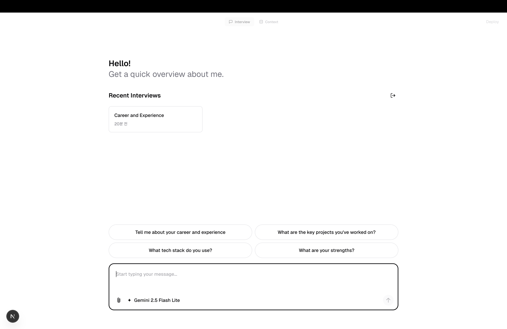
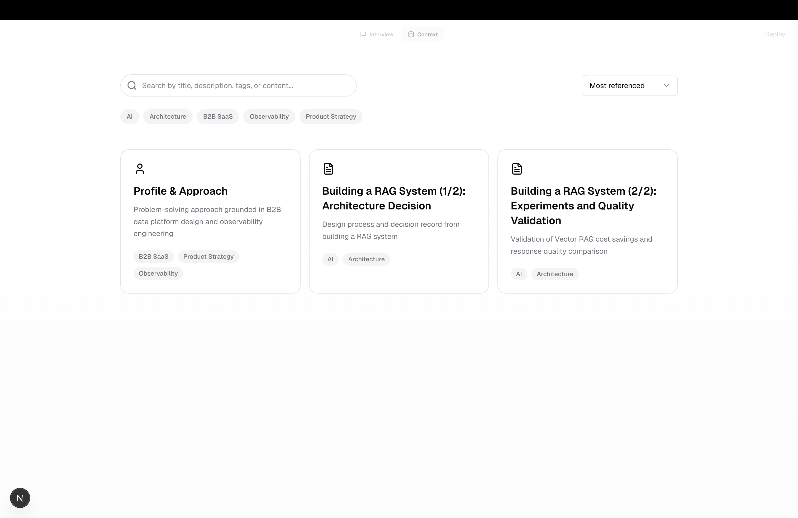
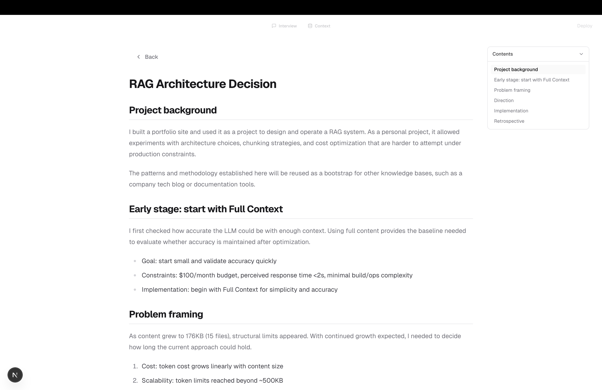
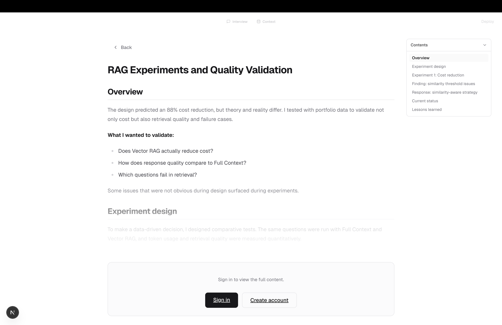

# AI Chatbot Blog Template

Next.js 16 App Router template for a streaming AI chat UI with Auth.js, PostgreSQL (pgvector), and a markdown-backed blog context.

[](https://vercel.com/new/clone?repository-url=https://github.com/swlee93/ai-chatbot-blog)

## Overview

Template for a chat-first portfolio. It starts from vercel/ai-chatbot and adds a markdown-backed knowledge base (Context) that the Interview (Chat) UI uses to ground answers.

- Routes: Interview (/chat), Context (/blog/context), Auth (/login, /register)
- Data flow: Markdown in [content/](content/) → optional RAG indexing (pnpm rag:sync) → chat responses
- Runtime: Vercel AI SDK streaming in [app/(chat)/api/chat/route.ts](app/(chat)/api/chat/route.ts)
- Storage: PostgreSQL + Drizzle ORM for chats, messages, and per-message references
- Config: UI copy and branding in [public/ai-chatbot-blog.yaml](public/ai-chatbot-blog.yaml)

## Screenshots







## Running locally

You will need to use the environment variables defined in [.env.example](.env.example) to run Next.js AI Chatbot. It’s recommended you use Vercel Environment Variables for this, but a local .env file is all that is necessary.

Note: Do not commit your .env file. It contains secrets that grant access to AI and authentication providers.

### Use Vercel Environment Variables (recommended)

1. Install Vercel CLI
2. Link local instance with Vercel and GitHub accounts (creates a .vercel directory)
3. Download your environment variables (creates .env.local automatically)
4. Install dependencies and run

```bash
npm i -g vercel
vercel link
vercel env pull
pnpm install
pnpm db:migrate
pnpm dev
```

Your app template should now be running on localhost:3000.

### Environment variables (detailed)

- `AUTH_SECRET` — Random secret used to sign Auth.js session cookies.
	- Generate using https://generate-secret.vercel.app/32 or `openssl rand -base64 32`.
- `AI_GATEWAY_API_KEY` — Vercel AI Gateway key for non-Vercel deployments.
	- On Vercel, OIDC tokens are used automatically and this is optional.
- `BLOB_READ_WRITE_TOKEN` — Vercel Blob token for file uploads and artifact storage.
- `OPENAI_API_KEY` — Required for embeddings and RAG sync.
- `POSTGRES_URL` — PostgreSQL connection string (pgvector required).
- `REDIS_URL` — Optional. Used for resumable streams.

## Content

Blog content lives under `content/`. Replace the sample docs with your own profile, experience, tech stack, and projects.

## UI config (YAML)

UI copy and the deploy link are defined in [public/ai-chatbot-blog.yaml](public/ai-chatbot-blog.yaml).

- `CHAT_GREETING`: welcome title/subtitle/cta
- `CHAT_SUGGESTED_ACTIONS`: quick-start prompts
- `DEPLOY_LINK`: deploy button (`hide: true` to hide)

## RAG setup

```bash
pnpm run rag:sync
```

## Vercel deploy

### Required services

- Postgres with pgvector enabled (Neon or Supabase)
- Vercel Blob (uploads)
- Optional: Vercel AI Gateway

### Environment variables

- `AUTH_SECRET`
- `POSTGRES_URL`
- `AI_GATEWAY_API_KEY` (if not using Vercel OIDC)
- `OPENAI_API_KEY`
- `BLOB_READ_WRITE_TOKEN`
- `NEXTAUTH_URL`

Optional:

- `REDIS_URL`

